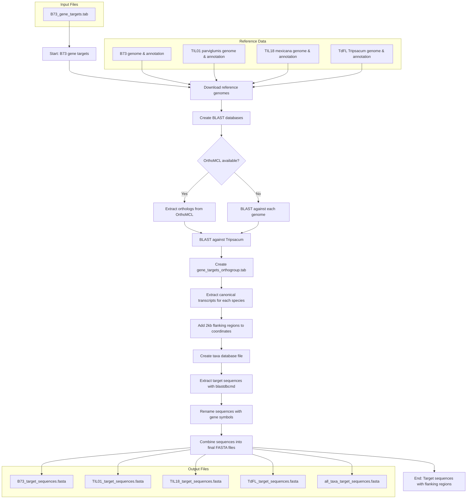

# Targetseq
Bzea target sequencing of HPC1 and nitrogen genes

## Part 1: Get Target sequences


## Part 2: De novo assembly of target sequencing data

```mermaid
flowchart TD
    subgraph "Setup"
        A[Raw Illumina Reads] --> |sample_annotation.tab| B["Directory Setup
        - raw/
        - clean/ 
        - assemblies/
        - blast_results/
        - alignments/
        - logs/"]
        C["Reference Files
        - B73_target_sequences.fasta
        - TIL18_target_sequences.fasta"] --> B
    end
    
    subgraph "Step 1: Read Cleaning"
        B --> D["q_clean_reads.sh"]
        D --> |"fastp
        - dedup
        - quality phred ≥30
        - length ≥50bp"| E["Cleaned Reads
        sample_R1_001.clean.fastq.gz
        sample_R2_001.clean.fastq.gz"]
    end
    
    subgraph "Step 2: De Novo Assembly"
        E --> F["q_assemble_reads.sh"]
        F --> |"SPAdes
        - isolate mode
        - auto coverage cutoff
        - 8 threads, 20GB memory"| G["De Novo Assemblies
        scaffolds.fasta"]
    end
    
    subgraph "Step 3: BLAST Search"
        G --> H["q_find_target_contigs.sh"]
        C --> H
        H --> |"BLAST
        - makeblastdb
        - blastn megablast
        - extract best hits"| I["Target Contigs
        sample_best_hits.fasta
        gene.fas"]
    end
    
    subgraph "Step 4: Multiple Sequence Alignment"
        I --> J["q_align_sequences.sh"]
        J --> |"MAFFT
        - reorder
        - adjustdirection
        - auto algorithm"| K["Multiple Sequence Alignments
        gene_aligned.fasta"]
    end
    
    K --> L["Analysis & Visualization
    - Phylogenetic analysis
    - SNP identification
    - Evolutionary studies
    - Primer design"]
    
    style A fill:#f9f9f9,stroke:#333,stroke-width:1px
    style C fill:#f9f9f9,stroke:#333,stroke-width:1px
    style E fill:#e6f3ff,stroke:#333,stroke-width:1px
    style G fill:#e6f3ff,stroke:#333,stroke-width:1px
    style I fill:#e6f3ff,stroke:#333,stroke-width:1px
    style K fill:#e6f3ff,stroke:#333,stroke-width:1px
    style L fill:#f9fff9,stroke:#333,stroke-width:1px
    ```
