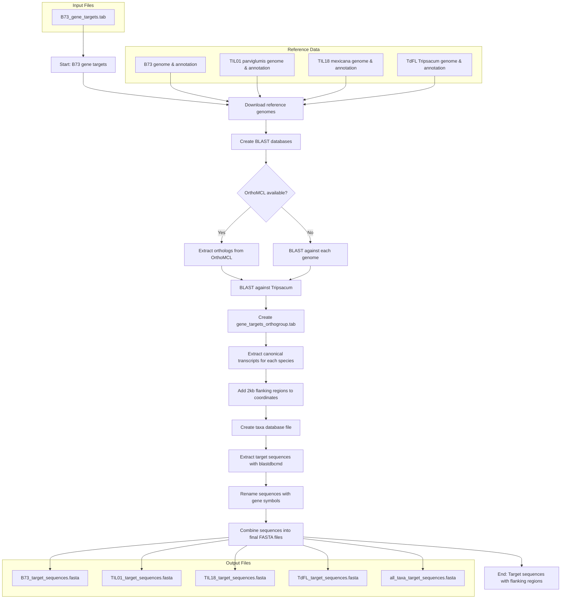

# Targetseq
Bzea target sequencing of HPC1 and nitrogen genes

```mermaid
flowchart TD
    A[Start: B73 gene targets] --> B[Download reference genomes]
    B --> C[Create BLAST databases]
    
    C --> D{OrthoMCL available?}
    D -->|Yes| E1[Extract orthologs from OrthoMCL]
    D -->|No| E2[BLAST against each genome]
    
    E1 --> F[BLAST against Tripsacum]
    E2 --> F
    
    F --> G[Create gene_targets_orthogroup.tab]
    G --> H[Extract canonical transcripts for each species]
    H --> I[Add 2kb flanking regions to coordinates]
    I --> J[Create taxa database file]
    J --> K[Extract target sequences with blastdbcmd]
    K --> L[Rename sequences with gene symbols]
    L --> M[Combine sequences into final FASTA files]
    M --> N[End: Target sequences with flanking regions]
    
    subgraph "Input Files"
    A1[B73_gene_targets.tab]
    end
    
    subgraph "Reference Data"
    B1[B73 genome & annotation]
    B2[TIL01 parviglumis genome & annotation]
    B3[TIL18 mexicana genome & annotation]
    B4[TdFL Tripsacum genome & annotation]
    end
    
    subgraph "Output Files"
    O1[B73_target_sequences.fasta]
    O2[TIL01_target_sequences.fasta]
    O3[TIL18_target_sequences.fasta]
    O4[TdFL_target_sequences.fasta]
    O5[all_taxa_target_sequences.fasta]
    end
    
    A1 --> A
    B1 --> B
    B2 --> B
    B3 --> B
    B4 --> B
    
    M --> O1
    M --> O2
    M --> O3
    M --> O4
    M --> O5
```
