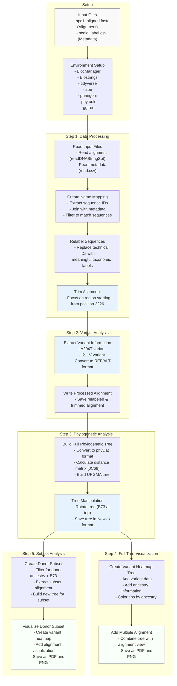

# Targseq
Bzea target sequencing of HPC1 and nitrogen genes

# Table of contents

- [Targseq](#targseq)
  - [Part 1: Get Target sequences](#part-1-get-target-sequences)
  - [Part 2: De novo assembly of target sequencing data](#part-2-de-novo-assembly-of-target-sequencing-data)

## Part 1: Get Target sequences

## Part 2: De novo assembly of target sequencing data

## Part 3: Phylogeny estimation

